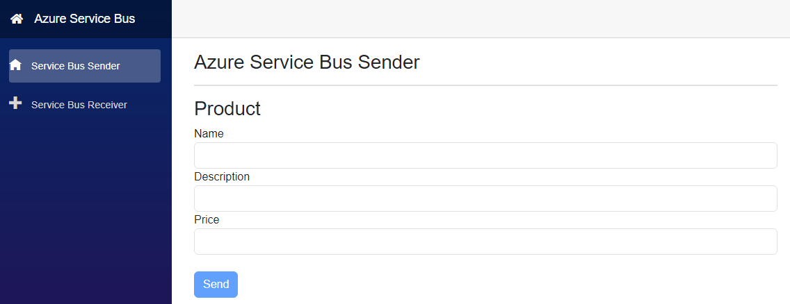
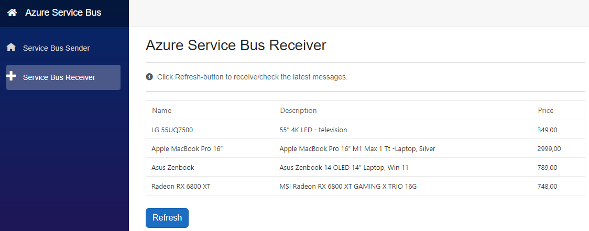
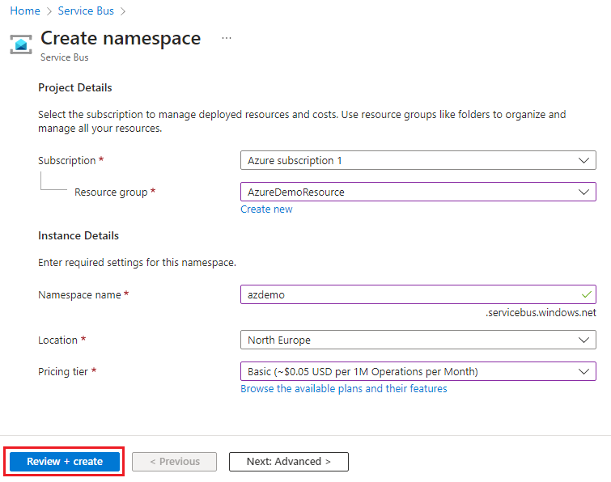
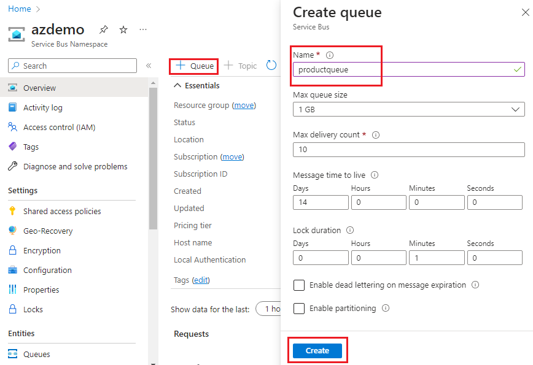
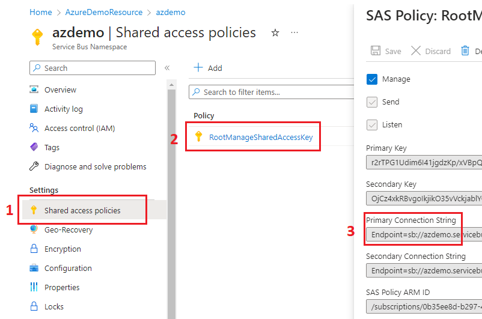

## Azure Service Bus - Message Sender & Receiver

`.NET C# 6.0, Blazor Server App & Azure`

`Visual Studio Professional 2022`

------

#### Service Bus Sender



#### Service Bus Receiver



------

#### **How to run the solution** (Local Computer)

1. Use git to clone a Git repository to a specific folder on your local machine. 

2.  Azure: 

- ```
  Open Azure Service Bus and click "Create namespace".
  ```

   


- ```
  Open Service Bus Namespace you just created and click "+ Queue" (App is using "productqueue" -queue). 
  ```

  


- ```
  Copy Connection String: 1) Shared access policies, 2) RootManageSharedAccessKey and 
  3) Primary Connection String.
  ```
  
  

3.  Visual Studio (2022)

   - **File** -> **Open** -> **Project/Solutions** -> `AzureServiceBus.sln` 
   - **Replace** `<AzureServiceBus/>` value in `"AppSettings.json"` (Azure Service Bus Connection String)
   - **Debug** -> **Start  Without Debugging** (Ctrl + F5)

---

#### Deploy App to Azure App Service

Manual Steps To Publish Blazor Server App as Azure Web App 

https://www.syncfusion.com/faq/blazor/host-and-deploy/how-do-i-deploy-a-blazor-server-application-to-azure-app-service

---

#### Additional Notes

###### NuGet Packages

- `Syncfusion.Blazor.Grid & Themes`
- `Azure.Messaging.ServiceBus`

   (Note: `Microsoft.Azure.ServiceBus` is deprecated).

---
[^]: (C) HKuokkanen 24.4.2023. 